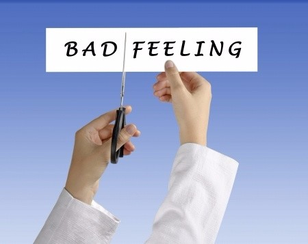

# Der Umgang mit entmutigenden Gedanken – speziell für Onlinekurs-Entwickler
01.05.2016

Online Kurse sind streckenweise eine einsame Sache mit viel intensiver Vorlaufzeit. Du investierst heftig, bevor Du ernten kannst. Das gleiche gilt für das Sichtbarwerden im Internet. Es wird immer wieder Punkte geben, an denen Du scheinbar nicht weiter kommst, an denen Du zweifelst, ob Du den richtigen Weg eingeschlagen hast. Ich will Dir heute Werkzeuge an die Hand geben, wie Du mit solchen Selbstzweifeln umgehen kannst. Interessiert? Dann freue ich mich, wenn Du weiter liest.

## Table of Contents
  * [Der Umgang mit entmutigenden Gedanken – speziell für Onlinekurs-Entwickler](Der-Umgang-mit-entmutigenden-Gedanken-–- speziell-für-Onlinekurs-Entwickler)
    * [Viel Mut für Dich!](#viel-mut-fuer-dich)
    * [Was genau erfordert online so viel Mut?](#was-genau-erfordert-online-soviel-mut)

## Der Auslöser für diesen Artikel
Gerade nehme ich an einer Sichtbarkeits-Challenge von Christina Emmer teil. Es geht um Coaches, wie Dich, die mit ihrer Präsenz im Internet durchstarten wollen. Eine Challenge ist eine geführte Gruppen-Aktion, bei der eine Gruppe Gleichgesinnter gemeinsam aufbricht, um unter Anleitung etwas Neues zu wagen. In diesem speziellen Fall geht es um die Online-Sichtbarkeit.

### Sichtbarwerden im Internet erfordert Mut
Eine Erkenntnis, die ich aus der Challenge gerade mitnehme, ist, dass das Sichtbarwerden im Internet ganz viel Mut erfordert. Mut und Angst werden sowohl von der Gruppe als auch von den Veranstaltern immer wieder thematisiert. Es gibt eine Lektion „Angst“ und eine andere „Raus aus der Ich muss erst noch Falle“. Beide signalisieren, dass beim Online-Gang auch mental Hürden zu überwinden sind. Die Teilnehmer selbst sind überwältigt von ihrem eigenen Mut jetzt in der Challenge. Manche gestehen, dass sie ihre Idee schon jahrelang in sich tragen, seit Monaten technisch ausgerüstet sind, aber dennoch: Den Sprung ins kalte Wasser der Online-Sichtbarkeit wagen sie erst jetzt im geschützten Raum der Challenge.

### Es ist ein langer Weg
Auch wenn es schön ist, diese euphorische Stimmung mit zu erleben, so weiss ich doch aus eigener Erfahrung, was für ein langer dorniger Weg, da noch vor diesen Coaches liegt. Ich selbst bin als Programmiererin technisch sicher bestens gerüstet und dennoch ist auch für mich der Weg in die Online-Sichtbarkeit eine echte Herausforderung. Es ist nicht die Technik, die für viele zum Stolperstein wird, sondern die mentale Einstellung: das Aufgeben, bevor es richtig angefangen hat. Und genau darauf liegt der Fokus meines Artikels: Was genau ist am Online-Gang eigentlich so schwierig und wie kannst Du mit den Selbstzweifeln umgehen, die dabei auf Dich lauern. Idealerweise sollten sie Dir helfen, Deinen Weg zu ebenen. Was Du vermeiden willst, ist Entmutigung. Gib ihnen nicht die Macht, Dich auszubremsen!

## Mentale Herausforderung des Online-Gangs
Worin genau besteht die mentale Herausforderung beim Aufbau Deiner Online-Präsenz? Warum empfinden das viele Menschen einschliesslich mir selbst als so schwierig? Physische Gefahren warten dort nicht auf Dich. Das Problem hat eher damit zu tun, dass wir zwar im Internet-Zeitalter leben aber unsere Instinkte noch nicht nachgezogen haben. Sehen wir uns die Probleme im Detail an:

### Im Internet gibt es anfangs keinen Raum für Dich
Es ist ungewohnt, dass Du im Internet erst mal unsichtbar bist. Weder Dein Blog noch Deine Facebook-Seite nehmen am Anfang einen Raum dort ein. Deine Blogbeiträge werden nur von wenigen Leuten gelesen und auch nur dann, wenn Du aktiv auf sie aufmerksam machst.

### Es fehlt die Resonanz
Deine Unsichtbarkeit führt zu einem weiteren Problem: Du hast online noch keine Resonanz. Selbst wenn Du schon einige Abonnenten hast, erfährst  Du selten, wie Deine Beiträge ankommen sind, oder was Deine Zielgruppe von Dir hören will. Offline geht es oft ums Zuhören, aber online scheinst Du ins Leere zu schreiben.

### Und trotzdem musst Du Dich richtig anstrengen
Und trotzdem musst Du Dich mächtig ins Zeug legen. Denn Dein Blog ist Dein Gesicht im Internet. Du schreibst, um Deine Zielgruppe anzusprechen. Dein Erscheinungs-Rythmus steht für Deine Zuverlässigkeit. In der Vernetzung mit anderen zielst Du darauf ab, für sie zum planbaren Faktor zu werden. Erst dadurch erschaffst Du Dir online allmählich einen eigenen Raum.

### Wie gehst Du in dieser Phase mit Selbstzweifeln um?
Selbstzweifel sind in der Anfangsphase unausweichlich und können durchaus berechtigt sein. Vielleicht hast Du beim Bloggen noch nicht Deinen Stil gefunden? Vielleicht ist Deine Facebook-Strategie grundlegend falsch. Es geht nicht darum Deine Selbstzweifel zurückzudrängen, sondern sie in die richtige Relation zu setzen. Nimm ihnen das Potenzial, Dich vorzeitig auszubremsen.

## Was genau erfordert online so viel Mut?
Wir haben gesehen, dass Du online heftig in Vorleistung gehen musst, ohne anfangs viel dafür zurück zu erhalten. Aber warum ist das oft so entmutigend für uns?

### Angst vor Ablehnung ist einer unserer Urinstinkte.
Ich denke, hinter unserer Verkrampfung steckt oft eine Angst vor Ablehnung. Wenn wir sie schliesslich überwinden, und in die Sichtbarkeit gehen, dann stellen wir uns dabei Menschen vor, die auf unsere Angebote warten. Nur dadurch gelingt uns diese grosszügige Vorleistung. Wir bauen unser Präsenz mit dem Blick auf unsere Zielgruppe aus. Und wenn diese Menschen dann nicht kommen, neigen wir dazu, das als Zurückweisung zu interpretieren. Wir blähen die Enttäuschung auf, statt uns auf die kleine Stellschraube zu fokusieren, die noch nicht richtig eingestellt ist.

### Für Urzeitmenschen war Ablehnung tödlich
Für unser Vorfahren konnte die Ausgrenzung aus dem Stamm tödlich enden. Deswegen waren diese Ängste in der Urzeit sicher berechtigt. Aber heute ist das nicht mehr so. Wir können heute eine Scheidung von unserem Partner überleben. Kinder können die Trennung von ihren Eltern überstehen. Es gibt soziale Netze, die uns in fast jeder Lebenslage auffangen. Und dennoch hat uns diese Angst vor Ausgrenzung uns niemals losgelassen.

### Im Internet sind unsere Zugehörigkeiten verworren
Unsere Zugehörigkeiten im Internet sind heute verworren. Wir agieren mit 1000 Facebook-Freunden und haben keine Idee, was Freundschaft in diesem Zusammenhang bedeuten soll. Es gibt die Dunbar-Zahl, die begrenzt zu wieviel Menschen wir wirklich in Kontakt sein können. Diese Anzahl liegt jedenfalls unter 250. Wir haben keinen Stamm im Internet und trotzdem mischen sich hier alte Instinkte und moderne Marketing-Strategien, und wenn etwas schief geht, dann haben wir kein gefestigtes Muster für unsere Reaktion darauf.

### Deswegen stelle ich Dir jetzt meinen Notfallkoffer vor
Wenn Dir bei Deinem Ringen um Online-Sichtbarkeit also mal übertriebene Reaktionen in die Quere kommen sollten, dann könnte mein Notfall-Koffer für Dich von Nutzen sein:

## Die Methode von Russ Harris
Russ Harris ist ein amerikanische Psychologe. Er hat diverse Bücher geschrieben unter anderem „Raus aus der Glücksfalle – Ein Umdenkbuch in Bildern“ , aus dem ich Dir hier eine Methode vorstellen will. Es enthält viele wertvolle Übungen. Es hat nichts mit Online-Kursen zu tun, sondern hilft Dir insgesamt im Leben, Deine Entscheidungen so zu fällen, dass sie Dich voran bringen.

### Es geht um die vielen kleinen täglichen Entscheidungen
Laut Harris geht es um die vielen kleinen täglichen Entscheidungen. Du kannst Deinen Blog schreiben, oder einen Film ansehen, Joggen gehen oder Schokolade essen. Was für Dich das Richtige ist, hängt von Deinen Werten ab. Harris Methode hilft Dir dabei, in jedem Moment die Entscheidung zu treffen, die Deinen eigenen Werten entspricht. Damit erreichst Du insgesamt, im Leben voranzukommen in eine Richtung, die für Dich stimmig ist.

### Warum dazu der Umgang mit negativen Gedanken gehört
Die richtige Entscheidung wird oft durch negative Gedanken boykottiert. Du würdest ja gerne an Deinen Blog-Artikel schreiben, aber plötzlich schiesst Dir durch den Kopf, dass das Thema niemanden interessiert und schon ist Dein Elan dahin. Du willst Dich online vernetzen und eine Nachricht schreiben und dann denkst Du plötzlich, dass Du als Kontakt nicht interessant genug bist.

### Warum es nicht hilft, schlechte Gedanken einfach wegzuschieben
Vielleicht ist Dein erster Impuls die hinderlichen Gedanken einfach wegzuschieben. Laut Harris ist es nicht ratsam, eigene Gedanken zu unterdrücken. Das mag in guten Zeiten zwar funktionieren, aber die Gedanken lauern dann im Verborgenen auf Dich. Sie beobachten Dich und führen Listen gegen Dich. Wenn es Dir dann mal richtig schlecht geht, kommen sie hervor und nutzen Deine Schwäche aus, um noch tiefer in Deinen Wunden zu bohren.

### Lass stattdessen die Gedanken fliessen
Harris rät stattdessen, die Gedanken fliessen zu lassen. Entmutigende Gedanken sind okay, sie können auch gute Hinweise enthalten: Sie können Dir zeigen, wo Deine nächsten Lernfelder liegen. Dein Ziel ist es nicht, diese Gedanken wegzuschieben. Dein Ziel ist stattdessen, dass Dich Deine Gedanken nicht blockieren. Stell Dir Deine Gedanken wie einen Fluss vor. Du willst nur, dass sie nicht an einem Stein hängen blieben und den Wasserlauf behindern. Sie einen flüchtigen Moment vorbei fliessen zu lassen, das ist auch für den hinterhältigsten Gedanken noch okay.

### Wie kannst Du einen Gedanken fliessen lassen?
Damit ein Gedanke fliessen kann, musst Du seine Wirkung auf Dich entschärfen. Damit löst Du seinen Klammergriff, er findet keinen Halt mehr in Dir und fliesst ganz automatisch weiter.

### Wie Du Dich von einem Gedanken distanzieren kannst
In einem ersten Schritt formst Du ihn sprachlich um: Nehmen wir an der Gedanke war „Ich bin zu dumm dafür“. Das klingt wie eine Tatsache, vernichtend. Was ist, wenn Du Dir sagst: „Ich denke gerade, dass ich zu dumm dafür bin“. Das ist jetzt nur noch eine Meinung und angreifbar geworden.  In dieser Form fordert der Gedanke bereits Deinen Widerspruch heraus.

### So machst Du Deine Gedanken unschädlich
Noch unschädlicher werden Deine Gedanken, wenn Du sie als Geschichten siehst und ihnen einen Namen gibst: etwa die „Ich bin zu dumm dafür“-Saga. Damit hast Du Deinen Gedanken entlarvt als das, was er ist: eine Geschichte, die konkurriert mit vielen anderen möglichen Geschichten. Ausserdem kannst Du ihn so leichter wieder erkennen, wenn er das nächste Mal vorbei driftet. Du musst ihn dann gar nicht mehr genau ansehen, da Du schon im Anflug erkennst, um welche Geschichte es sich dabei handelt.

### Dann kannst Du entscheiden, was Du Dir anschauen willst
Wenn Du Deine Gedanken fliessen lässt, kannst Du selbst entscheiden, was Du Dir anschauen willst. Ist ein Gedanke hilfreich, dann kannst Du ihn eine Weile festhalten und Dich mit ihm beschäftigen. Im anderen Fall lässt Du ihn weiterziehen. Du kannst auf diese Weise ganz rational Deine Entscheidungen treffen und hast eine gute Chance, Dein Ziel auch bei heftigem Gegenwind noch zu erreichen.

## Viel Mut für Dich!
Jetzt wünsche ich Dir Mut für Deinen eigenen Weg in die Online-Sichtbarkeit. Wenn Dir mein Artikel gefallen hat, oder wenn Du Fragen oder Anmerkungen hast, dann freue ich mich über Deine Resonanz :).
